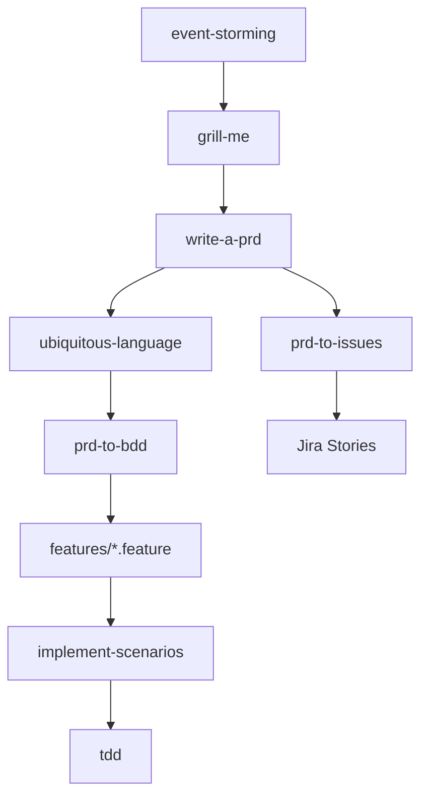
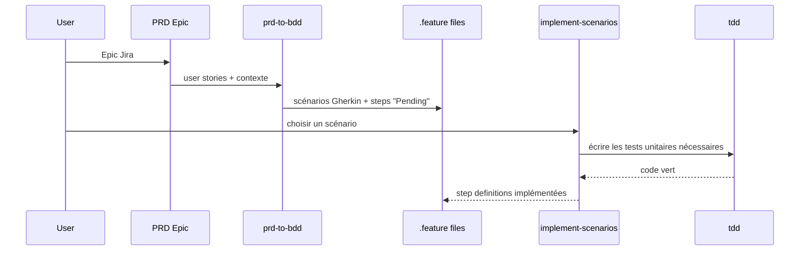

# Workflow BDD et découpage des skills

Ce document explique comment utiliser les skills autour du BDD, et la différence entre `prd-to-bdd` et `implement-scenarios`.

## Ordre recommandé

1. `event-storming` — capturer le domaine et les concepts clés.
2. `grill-me` — clarifier le problème et les décisions.
3. `write-a-prd` — produire un Epic Jira avec le besoin et les user stories.
4. `ubiquitous-language` — fixer le vocabulaire canonique.
5. `prd-to-bdd` — transformer l'Epic en scénarios Gherkin et squelettes de steps.
6. `prd-to-issues` — découper l'Epic en Stories Jira liées aux scénarios.
7. `implement-scenarios` — implémenter les scénarios un par un.
8. `tdd` — servir de boucle interne pour les tests unitaires.

## Différence entre `prd-to-bdd` et `implement-scenarios`

| Skill | Rôle | Entrée | Sortie |
|---|---|---|---|
| `prd-to-bdd` | Spécification BDD | Epic Jira | `.feature` files + step skeletons |
| `implement-scenarios` | Implémentation BDD | `.feature` files | Code + tests + steps fonctionnels |

En bref : `prd-to-bdd` écrit le contrat en Gherkin, `implement-scenarios` le rend vrai.

## Flux global

## Zoom sur le BDD

## À retenir

- `prd-to-bdd` structure la discussion métier en scénarios.
- `implement-scenarios` transforme les scénarios en comportement réel.
- Les deux se complètent : l'un écrit la spec, l'autre l'implémente.
